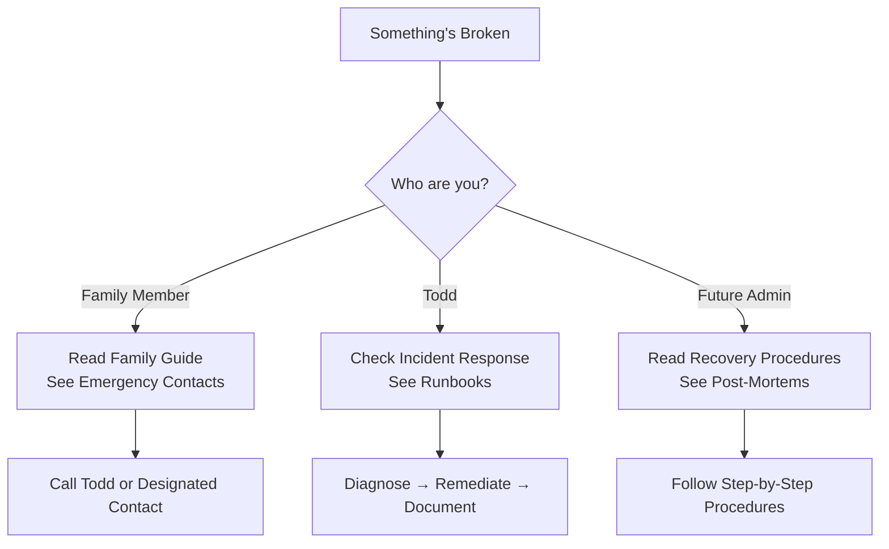
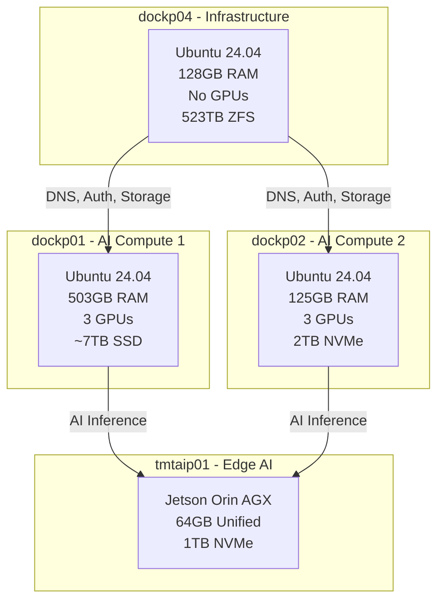

# TMT Homelab Documentation

> **Purpose**: Infrastructure documentation, operational runbooks, and disaster recovery procedures
> **Last Updated**: {{ 'now' | git_revision_date }}
> **Maintained By**: Todd Miller

---

## Welcome

This is the central documentation hub for the Miller Tribe homelab infrastructure. It serves three primary audiences:

| Audience | Start Here |
|----------|-----------|
| **Family Members** | [Family Guide](getting-started/family-guide.md) — What services exist, who to call in an emergency |
| **Operators** | [Operations Runbooks](operations/runbooks/overview.md) — Day-to-day troubleshooting and procedures |
| **Disaster Recovery** | [Recovery Procedures](disaster-recovery/recovery-procedures/overview.md) — Step-by-step rebuild guides |

---

## Quick Navigation

### For Emergency Situations

### Documentation Structure

| Section | What's Inside | Who Uses It |
|---------|--------------|-------------|
| [Getting Started](getting-started/overview.md) | Overview, family guide, emergency contacts | Everyone |
| [Infrastructure](infrastructure/hosts.md) | Physical hosts, storage, networking, GPUs | Operators, DR |
| [Services](services/ai-ml/overview.md) | Service-specific documentation | Operators |
| [Disaster Recovery](disaster-recovery/backup-strategy.md) | Backup strategy, recovery procedures, post-mortems | DR, Future Admin |
| [Operations](operations/runbooks/overview.md) | Runbooks, monitoring, common tasks | Operators |
| [Security](security/secrets-management.md) | Secrets management, access control | Operators, Security |
| [Reports](reports/incident-reports/) | Incident reports, capacity forecasts, audits | Operators, Management |

---

## System Overview

### Physical Infrastructure

### Key Services

| Category | Services |
|----------|----------|
| **Reverse Proxy** | Caddy (automatic HTTPS, Cloudflare integration) |
| **Authentication** | Authentik (SSO, OAuth2, LDAP) |
| **AI/ML** | LiteLLM, vLLM, Open WebUI, Milvus |
| **Media** | Plex, Sonarr, Radarr, Overseerr, Tautulli |
| **Monitoring** | Netdata, Uptime Kuma, Splunk |
| **Automation** | Prefect, Admin API, GitHub Actions |
| **Secrets** | OpenBao, 1Password Connect |
| **Home Automation** | Home Assistant, Zigbee2MQTT, MQTT |

---

## How to Use This Documentation

### For Non-Technical Family Members

1. **Emergency?** → Go to [Emergency Contacts](getting-started/emergency-contacts.md)
2. **Service Down?** → Check [Service Status](services/monitoring/overview.md)
3. **Need Access?** → See [Access Request Process](security/access-control.md)

### For Operators

1. **Incident Response** → Start with [Incident Response Guide](operations/incident-response.md)
2. **Troubleshooting** → Check relevant [Runbook](operations/runbooks/overview.md)
3. **Changes** → Follow [Change Management](infrastructure/networking.md) procedures

### For Disaster Recovery

1. **Assess Damage** → Determine scope (single container, host, or storage)
2. **Choose Procedure** → Select appropriate [Recovery Procedure](disaster-recovery/recovery-procedures/overview.md)
3. **Follow Steps** → Execute step-by-step, documenting any deviations
4. **Post-Mortem** → Write incident report after resolution

---

## Important Notes

### ⚠️ Security Warning

- **DO NOT** share this documentation externally
- **DO NOT** store actual secrets in these documents (reference secret paths instead)
- **DO** report any suspected exposure immediately

### 🔄 Documentation Freshness

- Infrastructure data is auto-synced every 15 minutes via Prefect
- Runbooks are reviewed quarterly
- Post-mortems are written within 48 hours of any incident

### 📞 Support

| Issue Type | Contact |
|------------|---------|
| **P1 - Critical Outage** | Phone Todd directly |
| **P2 - Service Degradation** | Slack #homelab-alerts |
| **P3 - Non-Urgent** | Create GitHub issue in homelab-docs |

---

## Version Information

| Document Version | Last Updated | Changes |
|-----------------|--------------|---------|
| 1.0 | 2026-03-11 | Initial documentation structure created |

---

## Quick Links

- [GitHub Repository](https://github.com/tmttodd/homelab-docs)
- [Infrastructure GitOps](https://github.com/tmttodd/homelab-gitops)
- [Service Status Dashboard](https://uptime.themillertribe-int.org)
- [Internal Wiki](https://docs.themillertribe-int.org)

---

*This documentation is maintained automatically where possible. Manual contributions should follow the [documentation standards](getting-started/overview.md).*
